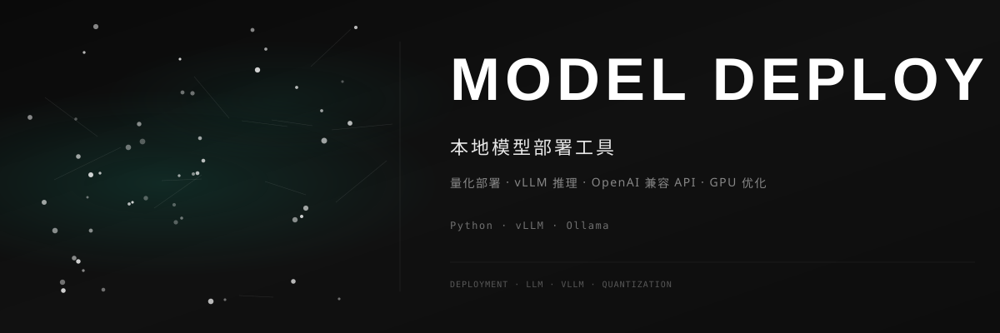

<div align="center">



<br>

### 🚀 本地模型部署工具

[](https://github.com/dirjaker/model_deploy/stargazers)
[](https://github.com/dirjaker/model_deploy/network/members)
[](https://github.com/dirjaker/model_deploy/graphs/contributors)
[](https://github.com/dirjaker/model_deploy/blob/dev/LICENSE)

</div>

---

## ✨ 功能特性

| 功能 | 描述 |
|------|------|
| 📦 **量化部署** | 支持 GPTQ、AWQ、GGUF 等多种量化格式 |
| ⚡ **vLLM 推理** | 基于 vLLM 的高性能推理服务 |
| 🔌 **OpenAI 兼容** | 提供 OpenAI API 兼容接口 |
| 🖥️ **Ollama 集成** | 一键拉取和运行 Ollama 模型 |
| 📊 **性能监控** | GPU 使用率、推理延迟、吞吐量监控 |
| 🔧 **配置管理** | 模型配置文件管理和切换 |


## 🚀 快速开始

```bash
# 克隆项目
git clone https://github.com/dirjaker/model_deploy.git
cd model_deploy

# 创建虚拟环境
conda create -n model_deploy python=3.12 -y
conda activate model_deploy

# 安装依赖
pip install -r requirements.txt

# 运行项目
python main.py
```

## 🛠️ 技术栈

| 层级 | 技术 |
|------|------|
| **推理引擎** | vLLM, Ollama |
| **量化** | GPTQ, AWQ, GGUF |
| **API** | FastAPI, OpenAI SDK |
| **GPU** | CUDA, PyTorch |

## 📝 开发日志

- [x] 量化部署工具
- [x] vLLM 推理服务
- [x] OpenAI 兼容 API
- [x] Ollama 集成
- [x] CLI 管理工具
- [ ] Web 管理界面
- [ ] 多 GPU 负载均衡
- [ ] 模型热更新

## 📄 许可证

[MIT License](LICENSE)

---

<div align="center">

🔗 **GitHub**: [dirjaker/model_deploy](https://github.com/dirjaker/model_deploy)

⭐ 如果这个项目对你有帮助，请给一个 Star 支持一下！

</div>
